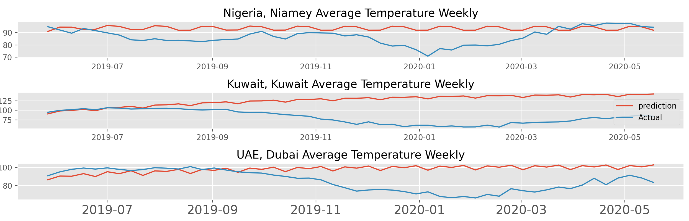
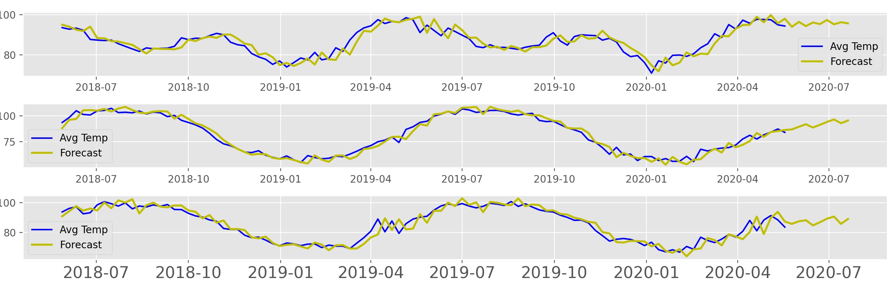

# Forecasting Rise In Temperatures

 With temperatures slowly on the rise and global warming on the forefront of every nations mind, I wanted to take a shot at making some visualizations to show just how much temperatures have risen in the past 10 years as well as predict what the temperatures may look like in the years to come for some of the worlds hottest cities.

 I started out with a dataset from the United Nations which had the average temperature of any given day for cities all over the world ranging from the years 1995 to 2020. Orignally the beginning of this data is very sparse, with many countries not recording their average daily temperature so I had to fix that up for the earlier years. Other than that, this was an extremely clean dataset to work with!

 

 ## Initial Data Analysis ##
 ------------------------------

 
 
 To start off, I first wanted to see if I could spot some sort of general rising trend in temperatures over the years. Based just on this graph, it seems really hard to tell. In general there does seem to be some sort of rise, however it's not nearly as large of a rise as I was initially expecting. I also find it interesting to see that there does seem to be an almost random spike downwards and then back up around every 3 years or so. While I found this graph interesting, I wanted to double check and make sure there was some sort of general trend and performed a seasonal decompose on the monthly averages.
 
 
 

 This graph really surprised me, even with the data beforehand, I was expecting a much clearer looking general trend than the one we ended up getting in here. It still seems as if there is some sort of slow rise in the peaks, but it looks to be only a 1 to 2 degree difference even starting from 1995.

 Going forward, I decided it would be best to instead look at the cities I would be choosing for my models to see if I noticed anything happening with them as well.
 
 
 
 One thing I found interesting about these cities is that their average yearly temperature hasn't gone up by much. There are certain spikes to be certain and the majority of them seem to be on some sort of upwards trend since 1995, however they're relatively flat lined at least compared to how I originally thought in terms of temperature increases. One thing to note here however is that every single one of these cities has a yearly average of over 80 degrees. Being from Colorado, it's hard to imagine living in a place that has weather that's so hot that it's yearly average temperature is something I would consider toasty here. Many of these places get much hotter than this, such as Niamey, Nigeria hitting a max just this year of 120 degrees Fahrenheit

 With all of this in mind, I wanted to move on and start working on my model. After doing some research on which machine learning model would perform best, I ended up deciding to apply a SARIMAX model to each of the cities, as it seemed to handle seasonality and general trends extremely well.

 ## SARIMAX Models ##
 ------------------------------

 

 It looks like our model does an o.k job at predicting the temperatures, however it tends to favor it being hotter rather than colder, at least for this year of predictions. It also looks like it's captured some amount of general trend, which honestly surprised me. I was working with monthly averages on this data for the majority of it, which seemed to massively overfit the data and didn't capture anything happening besides the seasonality.

 With a good model, I decided to move on and start forecasting.

 
 
 While I didn't feel comfortable predicting too far into the future I did feel o.k predicting nearly 3 months into the future. While my data doesn't have anything past May of 2020 it did seem to predict relatively well the Avg Temperature before it over the span of around 2 years. I would like to get my hands on more data once the UN updates the average temperatures again to see how well this prediction fully turned out.
 

 ## Future Steps: ##
 As any data scientist would say, I would love to get my hands on more data to see if my model would then be able to predict the general trend any easier. I'm sure in the next 10 to 20 years we'll start seeing a larger rise in temperatures if green house gas emissions continue to rise, and I would love to be able to model something with a more clearer general trend if that is the case. Finally, instead of picking 3 similar cities, located pretty close to the equator, I would like to pick 3 vastly differing cities of varying distances of equators. I believe this would have given a much better contrast between the models as well as give some variety in the inital EDA.

 ## Conclusions: ##
 My goal orginally with this project was to try and show how much temperatures are rising by showing just how hot the world's hottest cities are getting. It turns out even the UN doesn't seem to have nearly enough data to be able to fully predict that. While there does seem to be some sort of general rising trend in temperatures across the world, it's hard to tell just how much it really is rising. My models seem to be able to predict based off that rising trend somewhat, but it's just too small to make a massive difference in temperature based on the data I performed my models on.