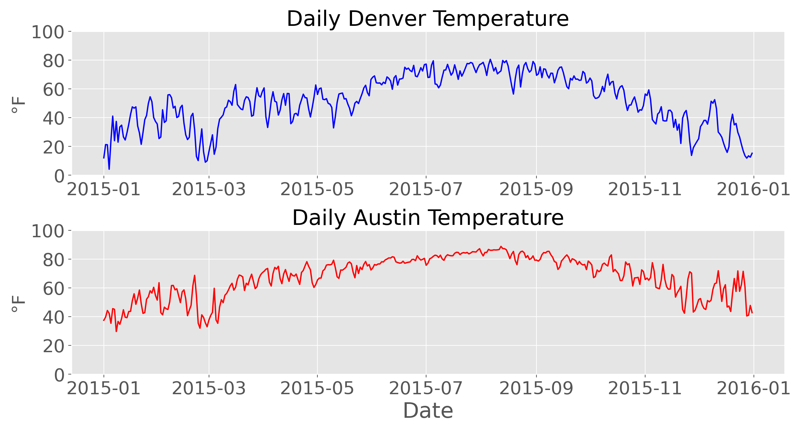
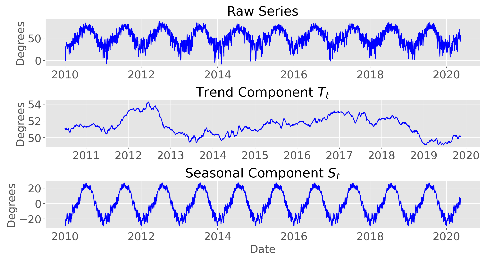
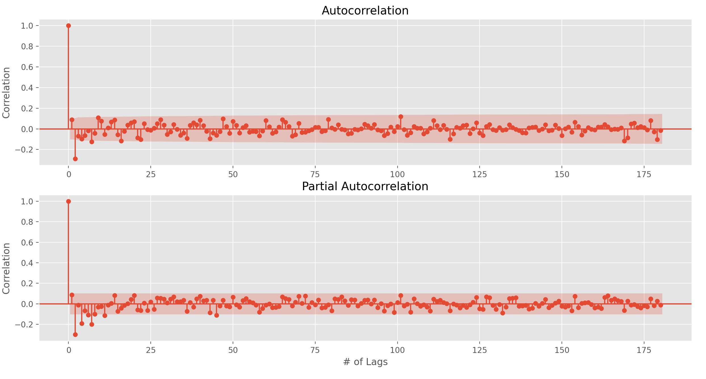
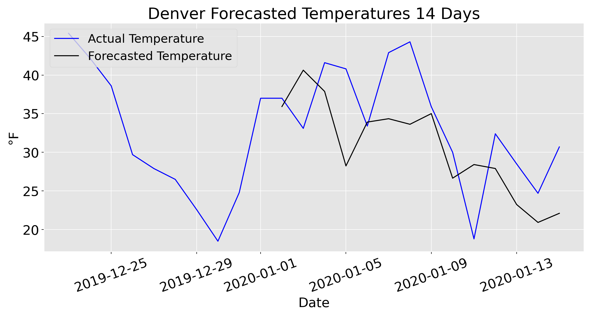
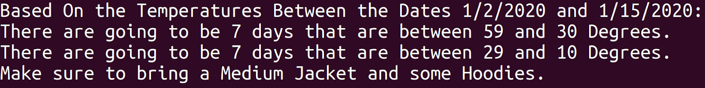

# Predicting what I should be wearing based on 14 day forecast

 I've always had an issue trying to figure out what I should be packing on a daily basis, and when you throw multiple days into the mix, I essentially become a mess. My goal for this project was to be able to create a proof of concept program that takes 14 days worth of forecasted average temperatures for a city and gives you suggestions on what you should wear that day based on the predictions.

 ## The Data
 ----------------------
 
 
 My Data came from the United Nations which gave me the average temperatures of cities from all across the world, daily. I then had to take this data turn it into a time series based on whatever city a user inputted, and from there I would be able to fit the model to my series. 

 ## Initial Data Analysis ##
 ------------------------------

 
 
 To start with my data analysis, I wanted to see if there would be a major difference between temperatures in two different citties. I started off with Austin and Denver and what I found really surprised me! For one while the temperatures are different from one another, they both end up following a general pattern VERY closely that I really didn't expect. I was going in with the assumption that the temperatures would begin to start following much earlier in Colorado near winter and stay colder for longer. But basded on the data, that doesn't seem to be the case. The other thing I want to point out is just how erratic the weather is. At many points, temperatures shift drastically up and down which really surprised me as well.
 
 
 

 I then wanted to take a look at the seasonal decomposition of my graph and found nothing too surprising. I did want to check and make sure that there was seasonality that could be seen in my data, and if you look at the seasonal trend, it clearly shows just that. Again nothing surprising, but it's why I ended up choosing a Sarimax model over just a basic Arima Model.

 

 Finally I wanted to check the correlation plots to try and find the variables for my sarimax model. If you don't know what these are, they're essentailly graphs that create lags within our dataset and allow us to see how much these lags would correlate with either an increase or decrease in temperature. Based on my findings, I was able to create a good baseline sarimax model which I then improved with a grid search.

 ## Predictions ##
 ------------------------------

 

 On to the predictions! My model ended up performing quite well here, with an MAE of 5.75 degrees. However in areas where the temperature wasn't as consistent, the MAE score rose to around 10 degress. If you look at the daily temperatures graph, you'll notice In March the temperature plummets and rises for both Austin and Denver, my model performed significantly worse there. 

 Based on the predictions above, I was able to create a program that would recommend what essential clothing items I should pack as seen below.
 

 ## Conclusions and Future Steps: ##
 While I certainly wish my model would perform better where the weather was more erratic, as a proof of concept I am relatively pleased. There's still plenty of room for improvement however. I would love to get a model running on an AWS server just so that it can of course perform better. I would also love to push this into a flask app, that way others could use this code and get my suggestions for them. Something I would find really cool, is if I were able to throw this in with a recommender model so that users with similar clothing preferences could get more accurate suggestions as well. Finally getting some different variables like preciptiation, the highest temperature of the day, and the lowest temperature of the day, I would be able to create a better performing model as well as give more suggestions like weather you should bring an umbrella or not.

