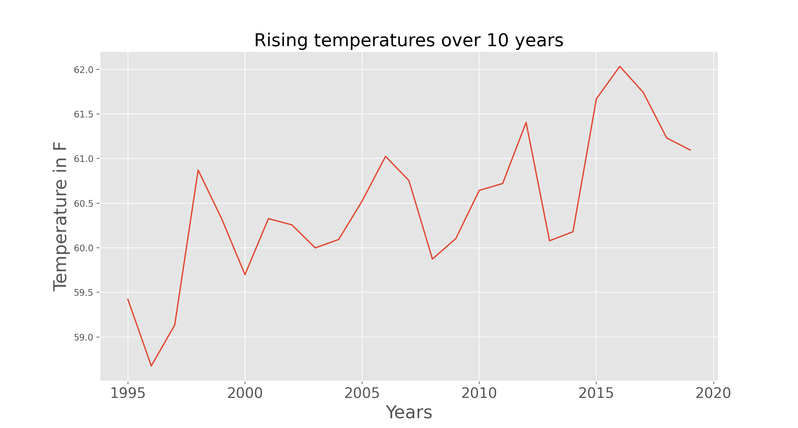
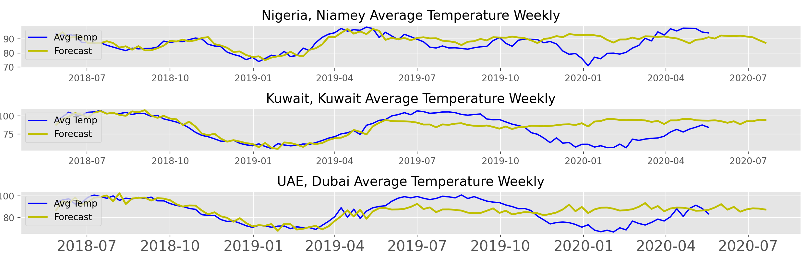

# forecasting_temperatures

 With temperatures slowly on the rise and global warming on the forefront of every nations mind, I wanted to take a shot at making some visualizations to show just how much temperatures have risen in the past 10 years as well as predict what the temperatures may look like in the years to come for some of the worlds hottest cities.

 I started out with a dataset from the United Nations which had the average temperature of any given day for cities all over the world ranging from the years 1995 to 2020. Orignally the beginning of this data is very sparse, with many countries not recording their average daily temperature so I had to fix that up for the earlier years. Other than that, this was an extremely clean dataset to work with!

 

 ## Initial Data Analysis ##
 ------------------------------

 
 
 To start off, I first wanted to see if I could spot some sort of general rising trend in temperatures over the years. Based just on this graph, it seems really hard to tell. In general there does seem to be some sort of rise, however it's not nearly as large of a rise as I was initially expecting. I also find it interesting to see that there does seem to be an almost random spike downwards and then back up around every 3 years or so. While I found this graph interesting, I wanted to double check and make sure there was some sort of general trend and performed a seasonal decompose on the monthly averages.
 
 
 

 As you can see, albiet it seems to be a very small increase, there is a general trend in temperatures going up between the years 2005 and 2016. There also seems to be a seasonality trend, which comes as no surprise to anyone, however it is something I'm going to have to account for in the SARIMAX model.

 Going forward, I wanted to figure out the 3 hottest cities based on their average yearly temperature as I believed these cities would be the best to model and show just how hot they're getting.
 
 
 
 One thing I found interesting about these cities is that their average yearly temperature hasn't gone up by much. There are certain spikes to be certain and the majority of them seem to be on some sort of upwards trend since 2008, however they're relatively flat lined at least compared to how I originally thought in terms of temperature increases. One thing to note here however is that every single one of these cities has a yearly average of over 80 degrees. Being from Colorado, it's hard to imagine living in a place that has weather that's so hot that it's yearly average temperature is something I would consider toasty here. Many of these places get much hotter than this, such as Niamey, Nigeria hitting a max just this year of 120 degrees Fahrenheit

 With all of this in mind, I wanted to move on and start working on my model. After doing some research on which machine learning model would perform best, I ended up deciding to apply a SARIMAX model to each of the cities, as it seemed to handle seasonality and general trends extremely well.

 ## Initial Data Analysis ##
 ------------------------------

 

 As you can see, our model does a very good job 

 

 
 
 Unfortunately, I wasn't able to get the Kuwait forecasting model to work, but with these other two it does seem to be overfitting just based on the seasonal trend itself.
 
 Conclusions:
 My goal orginally with this project was to try and show how much temperatures are rising by showing just how hot the world's hottest cities are getting. It turns out I severely understimated just how slowly the average monthly temperatures are rising. This made it hard for my model to see a general trend happening at all, which makes it not a great predictor for the far future.

 Future Steps:
 As any data scientist would say, I would love to get my hands on more data to see if my model would then be able to predict the general trend any easier. Also fixing the overfitting on this model would seem Also instead of basing my predictions off of monthly values, perhaps I should have tried to go with weekly, or even daily to try and forecast better. Finally I believe working with different cities may have yielded better results in terms of picking up a trend, as many of these cities haven't seen a massive degree in difference between their average yearly in 2005 and average yearly in 2016.